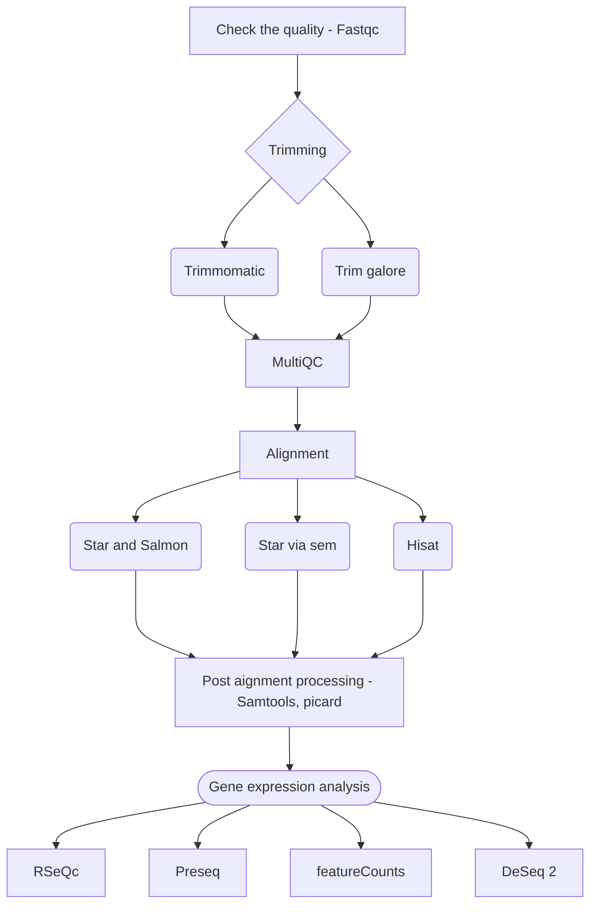

## Fastqc

## Trim Galore
 ```
 trim_galore \\
            $args \\
            --cores $cores \\
            --gzip \\
            $c_r1 \\
            $tpc_r1 \\
            ${prefix}.fastq.gz
 ```

## MultiQC

## Hisat2
```
INDEX=`find -L ./ -name "*.1.ht2" | sed 's/.1.ht2//'`
        hisat2 \\
            -x \$INDEX \\
            -U $reads \\
            $strandedness \\
            --known-splicesite-infile $splicesites \\
            --summary-file ${prefix}.hisat2.summary.log \\
            --threads $task.cpus \\
            $seq_center \\
            $unaligned \\
            $args \\
            | samtools view -bS -F 4 -F 256 - > ${prefix}.bam
```



